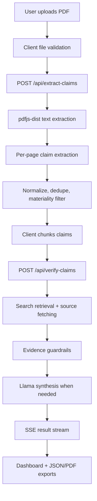
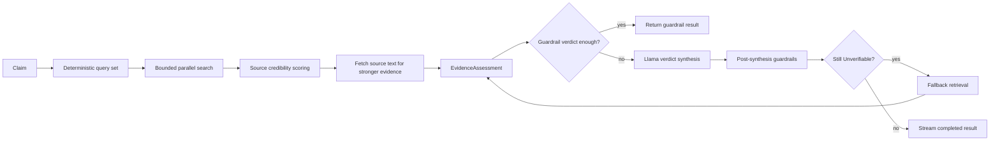
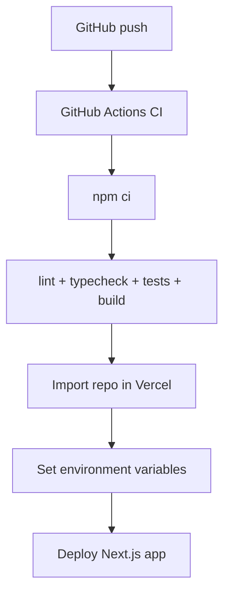
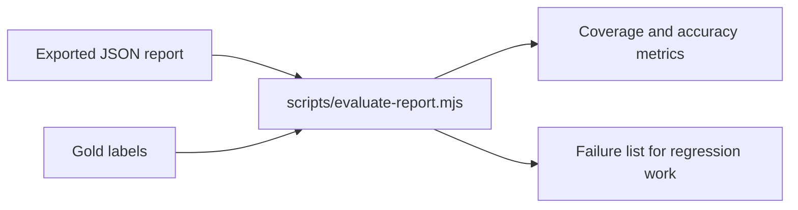

# 2see

2see is a production-oriented AI fact-verification app for PDFs. It extracts material factual claims, retrieves live web evidence, verifies each claim with Groq-hosted Llama models through an OpenAI-compatible API, and exports transparent JSON/PDF reports.

Tagline: **See what's actually true.**

## Core Workflow



## What It Does

- Upload PDFs up to 20 MB.
- Extract statistical, financial, technical, date, regulatory, event, and public-claim facts.
- Verify claims against live search evidence from Tavily, Serper, Mojeek fallback, and Wikipedia fallback.
- Prefer deterministic evidence guardrails when sources are strong enough, reducing unnecessary LLM calls.
- Avoid low-authority-only verification for exact public metrics and rankings.
- Return `Verified`, `Inaccurate`, `False`, or `Unverifiable` with confidence, sources, and diagnostic metadata.
- Stream results progressively and export reports as JSON or PDF.

## Tech Stack

- Next.js 15 App Router, React 19, TypeScript
- Tailwind CSS 4 and local shadcn-style components
- Groq OpenAI-compatible chat completions
- Llama 4 Scout 17B default, Llama 3.3 70B optional
- `pdfjs-dist` for PDF text extraction
- `@react-pdf/renderer` for PDF export
- Zod for request, AI output, and report validation
- Vitest for unit and regression tests

## Verification Flow



## Verdict Policy

2see treats `Unverifiable` as the final fallback, not the default. Exact public metrics, dates, rankings, and financial claims require related high/medium or primary evidence before they can be `Verified`. If credible sources discuss the same subject but do not support the exact value, date, attribution, or ranking, the app returns `Inaccurate` or `False` instead of hiding behind `Unverifiable`.

Low-authority-only sources can contribute context, but they cannot verify exact market, financial, benchmark, date, or ranking claims.

## Environment

Create `.env.local`:

```env
GROQ_API_KEY=your_groq_key

# Optional fallback key. Groq is used by default.
OPENAI_API_KEY=

# Optional but recommended for production accuracy.
TAVILY_API_KEY=
SERPER_API_KEY=

# Optional local/test controls.
DISABLE_CLAIM_CACHE=
SEARCH_FIXTURES_DIR=
```

At least one production search provider key is recommended. Without Tavily or Serper, the app falls back to Mojeek and Wikipedia, which is slower and less complete.

## Local Development

```bash
npm ci
npm run dev
```

Open `http://localhost:3000`.

Useful checks:

```bash
npm run typecheck
npm run lint
npm test
npm run build
```

## API Routes

All API routes use Node.js runtime.

- `GET /api/check-key`
  - Verifies that a Groq/OpenAI-compatible key is present and valid.
- `POST /api/extract-claims`
  - Accepts `multipart/form-data` with `file` and `model`.
  - Extracts text from PDF pages in memory.
  - Runs claim extraction with retry handling and safe claim caching.
- `POST /api/verify-claims`
  - Accepts `model` and `claims`.
  - Streams Server-Sent Events for started/completed claims.
  - Applies retrieval, evidence assessment, guardrails, LLM synthesis, fallback retrieval, and quota-safe fallback behavior.
- `POST /api/export-report`
  - Accepts validated report JSON.
  - Generates a PDF with report counts, verdicts, evidence metadata, sources, and corrections.

## Report Metadata

Each verification result may include:

- `decision_path`: `guardrail`, `llm`, `fallback`, or `knowledge`
- `comparator_verdict`: deterministic evidence comparator result
- `search_query_count`: number of retrieval queries attempted
- `evidence_status`: direct, related, weak, absent, conflicting, or technical failure
- `retrieval_status`: searched, fallback searched, exhausted, technical failure, or quota limited
- `reason_codes`: machine-readable diagnostics
- `duration_ms`: per-claim verification duration

## Deployment



Vercel setup:

1. Push the repository to GitHub.
2. Confirm GitHub Actions passes.
3. Import the repository into Vercel.
4. Add `GROQ_API_KEY`.
5. Add `TAVILY_API_KEY` or `SERPER_API_KEY` for stronger production retrieval.
6. Deploy.

The app avoids Edge runtime because PDF parsing, Groq calls, source fetching, and PDF export need Node.js APIs. Long routes define `maxDuration` for Vercel compatibility.

## Evaluation Harness

Gold labels for the supplied stress PDFs live under `tests/fixtures/evaluation`. They are test fixtures only and are not imported by runtime code.

After exporting a JSON report from the app, run:

```bash
npm run evaluate:report -- tests/fixtures/evaluation/2see_test_document.gold.json path/to/exported-report.json
```

The evaluator reports claim coverage, verdict matches, forbidden verdict hits, Unverifiable rate, low-only Verified count, quota fallback count, source authority mix, and average duration.



## Production Notes

- PDF uploads are processed in memory and are not persisted.
- Claim cache writes use memory plus a safe local or `/tmp` directory and never block extraction if unavailable.
- Client verification is chunked so serverless requests stay bounded.
- The browser never receives API keys.
- Test fixtures must not be used to special-case production behavior.

## Troubleshooting

- Missing key: set `GROQ_API_KEY` in `.env.local` and Vercel.
- Too many `Unverifiable` results: add `TAVILY_API_KEY` or `SERPER_API_KEY`, then rerun.
- Quota failures: switch to the 70B model only when needed, reduce document size, or wait for Groq quota reset.
- Image-only PDFs: OCR is not currently implemented, so text extraction may fail.
